# Introduction

Welcome to **Docs Unlocked**! A powerful, lightweight documentation system built specifically for Salesforce.

Docs Unlocked provides a beautiful, searchable documentation experience with minimal setup. Write your docs in Markdown, organize them in folders, and Docs Unlocked handles the rest.

## Key Features

- 📝 **Markdown Support** - Write documentation using simple markdown syntax
- 🔍 **Full-Content Search** - Search across all documentation pages instantly (Ctrl+K / Cmd+K)
- 🤖 **File Based Routing** - Automatically generates navigation from your file structure
- 📱 **Responsive Design** - Works beautifully on desktop, tablet, and mobile
- ⚡ **Fast & Lightweight** - Optimized for Salesforce performance
- 🎨 **Rich Content Support** - Embed images, videos, and probably other stuff
- 🎯 **Anchor Links** - Deep linking to specific sections within pages
- 🔐 **Conditional Visibility** - Show or hide content based on Salesforce permissions

## How It Works

Docs Unlocked consists of two main components:

1. **Lightning Web Component** - The Salesforce component that displays your documentation
2. **Content Files** - Your markdown files organized in folders, stored in a ZIP StaticResource

```mermaid
flowchart LR
    subgraph Your Content
        MD[📝 Markdown Files]
        IMG[🖼️ Media Files]
    end
    
    subgraph Salesforce
        SR[(ZIP StaticResource)]
        LWC[⚡ LWC Component]
        PAGE[Lightning Page]
    end
    
    MD --> SR
    IMG --> SR
    SR --> LWC
    LWC --> PAGE
```



Navigation is automatically generated from your file structure. You can also provide a `manifest.yaml` file for full control ([learn more](/getting-started/basic-usage#automatic-vs-manual-navigation)).

## Quick Start

### 1. Organize Your Content

Create markdown files organized in folders. Use numeric prefixes (like `01.getting-started`) for automatic ordering:

```plaintext
content/
├── 01.getting-started/
│   ├── 01.introduction.md
│   └── 02.basic-usage.md
└── 02.core-concepts/
    └── 01.configuration.md
```

For more details on file organization, see the [directory structure guide](/getting-started/basic-usage#directory-structure).

### 2. Create ZIP File

Package your `content/` folder (and optional `media/` folder) into a ZIP file. See [packaging instructions](/getting-started/basic-usage#packaging-your-content) for details.

### 3. Upload to Salesforce

1. Go to [**Setup** → **Custom Code** → **Static Resources**](lightning/setup/StaticResources/home)
2. Click **New**
3. **Name**: `docsContent` (or your preferred name)
4. **File**: Upload your ZIP file
5. **Cache Control**: **Public**
6. Click **Save**

### 4. Add to Lightning Page

1. Open Lightning App Builder
2. Add the "Docs Unlocked" component to your page
3. Set **Content Resource Name** to match your StaticResource name
4. Save and activate

That's it! Your documentation is now live.

> [!TIP]
> Docs Unlocked automatically generates navigation from your file structure. Just use numeric prefixes (like `01.getting-started`) for ordering, and titles are extracted from the first H1 header in each markdown file. For more details, see [Basic Usage](/getting-started/basic-usage).

## Navigation

Navigation is automatically generated from your content:

- **Sidebar** - Shows all sections and pages
- **Search** - Press `Ctrl+K` (or `Cmd+K` on Mac) to search all content
- **Previous/Next** - Navigate between pages at the top of content
- **Deep Links** - Share links to specific pages or sections
- **Anchor Links** - Jump to specific sections within pages using `#page-path::anchor-id`

## What's Next?

:::navcards
title: Basic Usage
description: Learn how to write markdown and organize your content
href: /getting-started/basic-usage
---
title: Troubleshooting
description: Solutions to common problems and issues
href: /getting-started/troubleshooting
---
title: Contributing
description: Learn how to contribute to Docs Unlocked (for developers)
href: /getting-started/contributing
---
title: Configuration
description: Customize your documentation settings and appearance
href: /core-concepts/configuration
---
title: Conditional Visibility
description: Control content visibility based on Salesforce permissions
href: /advanced-topics/conditional-visibility
:::

---
