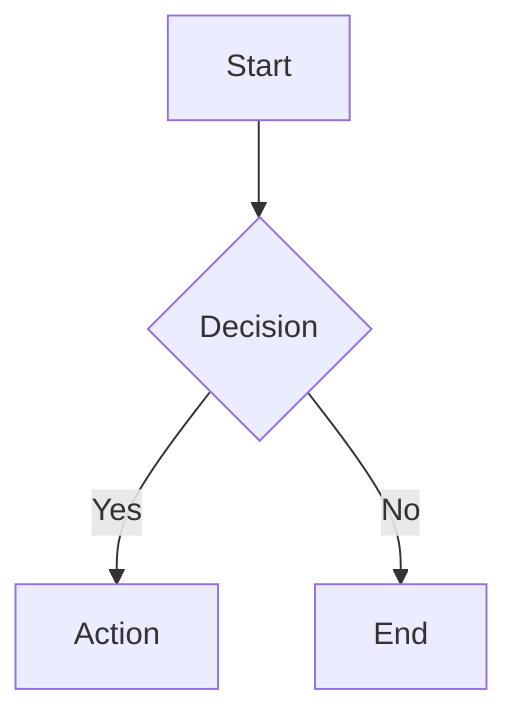
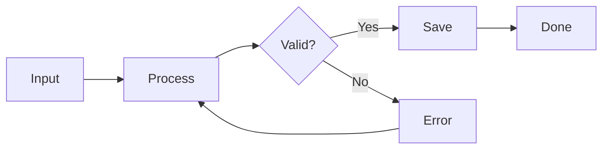
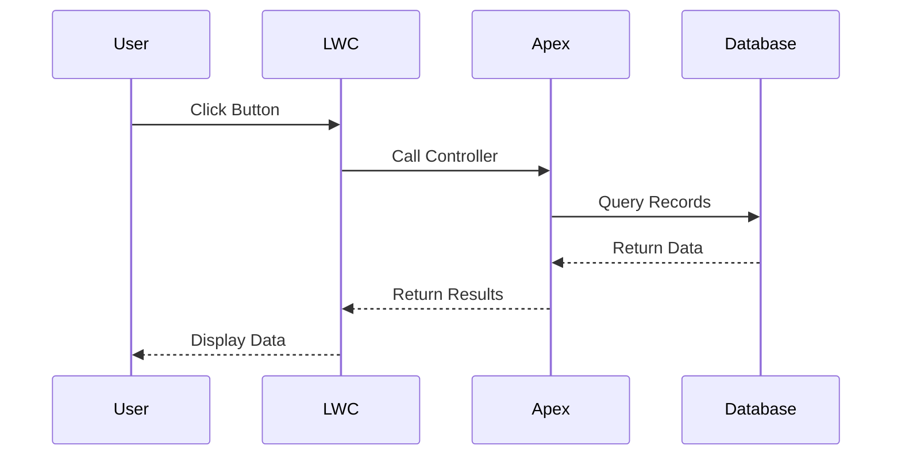
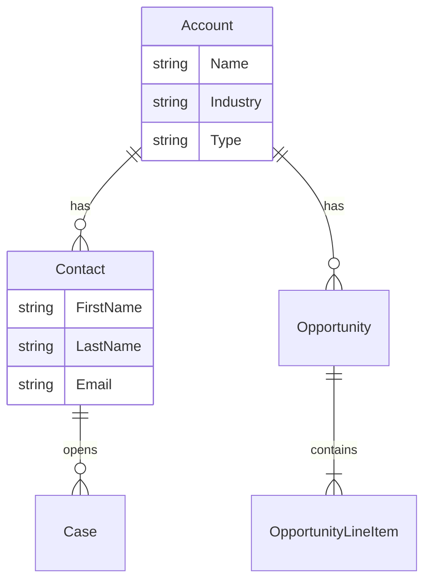
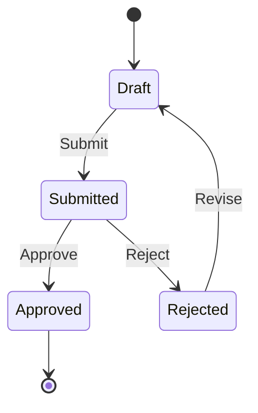
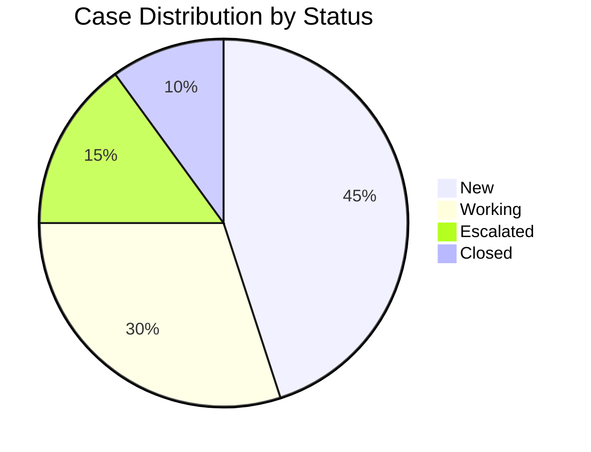
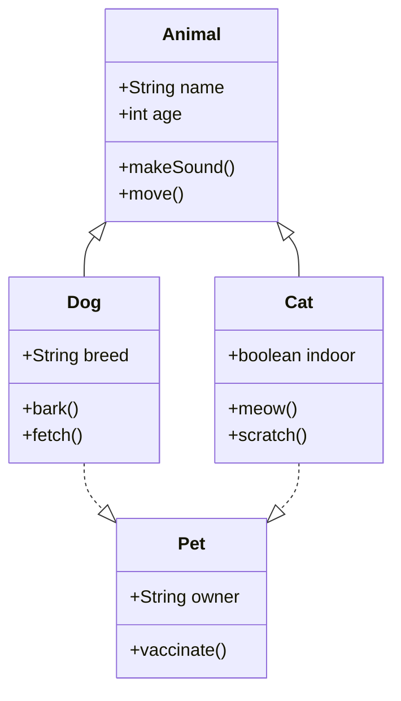
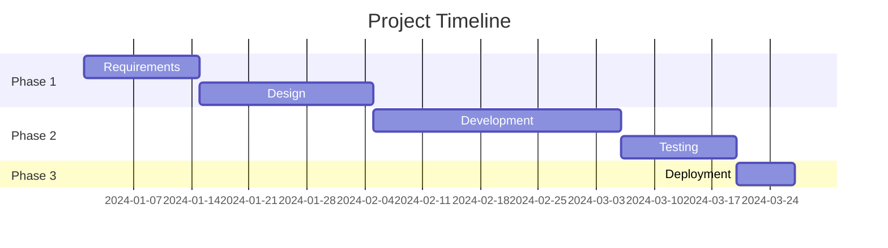

# Mermaid Diagrams

Docs Unlocked experimentally supports [Mermaid](https://mermaid.js.org/) diagrams, allowing you to create flowcharts, sequence diagrams, entity-relationship diagrams, and more directly in your markdown files.

## Basic Usage

To create a diagram, use a fenced code block with the `mermaid` language identifier:

````markdown

````

This renders as:


## Supported Diagram Types

Mermaid supports many diagram types. Here are some common ones:

### Flowcharts

Use `graph` or `flowchart` to create flowcharts with different directions (TD = top-down, LR = left-right):

````markdown

````


### Sequence Diagrams

Model interactions between components:

````markdown

````


### Entity Relationship Diagrams

Document data models and relationships:

````markdown

````


### State Diagrams

Visualize state machines and workflows:

````markdown

````


### Pie Charts

Simple data visualization:

````markdown

````


### Class Diagrams

Object-oriented design visualization:

````markdown

````


### Gantt Charts

Project timelines and schedules:

````markdown

````


## Styling Diagrams

You can customize diagram appearance using Mermaid's styling syntax:

````markdown

````


## Best Practices

> [!TIP]
> Keep diagrams simple and focused. Complex diagrams can be hard to read on mobile devices.

1. **Keep it simple** - Break complex diagrams into smaller, focused diagrams
2. **Use meaningful labels** - Make node labels clear and concise
3. **Choose the right type** - Pick the diagram type that best represents your data
4. **Test on mobile** - Diagrams are responsive but complex ones may need scrolling
5. **Add context** - Include explanatory text around your diagrams

## Limitations

- Diagrams render client-side, so there may be a brief delay before they appear
- Very complex diagrams may impact page performance
- Some advanced Mermaid features may not work in all browsers

## Learn More

For full Mermaid syntax documentation, visit the [official Mermaid documentation](https://mermaid.js.org/intro/).
